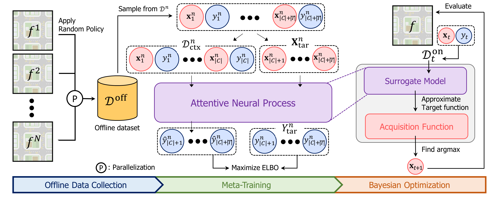
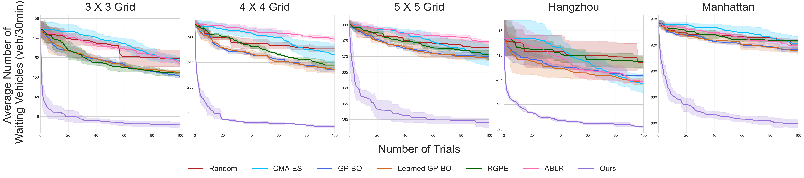

# An Offline Meta Black-box Optimization Framework for Large-scale Traffic Signal Control



This repository is the official implementation of *An Offline Meta Black-box Optimization Framework for Large-scale Traffic Signal Control*

## Requirements
First, you should install SUMO. Latest version (1.15.0) is required. https://sumo.dlr.de/docs/Downloads.php

To install requirements:

```setup
pip install -r requirements.txt
```

## Data Collection
To collect data for training our model, run this command. You can skip this procedure since we already save offline data for training by executing this code.
It takes couple of hours.

```collect_data
python collect_data.py --task <task_name>
```

## Training
To train our model, run this command:

```train
python train.py --task <task_name> --model <model_name> --exp_id <exp_id>
```

## Evaluation
To evaluate our model, run this command:

```test
python test.py --task <task_name> --model <model_name> --exp_id <exp_id> --scenario_id <scenario_id>
```

## Visualization
To visualize the result of our model compared to other baselines, run this command:

```visualize
python visualize.py --task <task_name> --exp_id <exp_id>
```

## All-in-one
You can run this command to execute all process:

```all-in-one
bash run_sumo.sh
```

## Results
Our model achieves the following performance on:

| Model name         | 3 X 3 Grid  | 4 X 4 Grid  | 5 X 5 Grid  |  Hangzhou   |  Manhattan  |
|--------------------|-------------|-------------|-------------|-------------|-------------|
| Random             |151.94 ± 0.86|262.72 ± 0.64|372.85 ± 1.88|408.49 ± 1.24|920.07 ± 4.24|
| CMA-ES             |151.58 ± 0.39|261.63 ± 2.15|370.47 ± 3.29|404.18 ± 1.89|920.79 ± 5.76|
| GP-BO              |150.02 ± 0.07|258.56 ± 0.41|369.93 ± 0.92|405.75 ± 0.22|916.57 ± 1.62|
| Learned GP-BO      |150.49 ± 0.21|258.62 ± 0.82|369.52 ± 0.84|404.64 ± 0.65|915.48 ± 1.92|
| RGPE               |150.43 ± 0.28|259.48 ± 0.88|370.49 ± 1.46|408.76 ± 1.27|923.19 ± 0.45|
| ABLR               |151.35 ± 0.31|264.72 ± 0.60|374.72 ± 0.39|404.71 ± 0.30|919.57 ± 3.50|
|   Ours             |**145.13 ± 0.24**|**247.06 ± 0.19**|**348.99 ± 1.46**|**395.51 ± 0.17**|**859.74 ± 3.02**|


